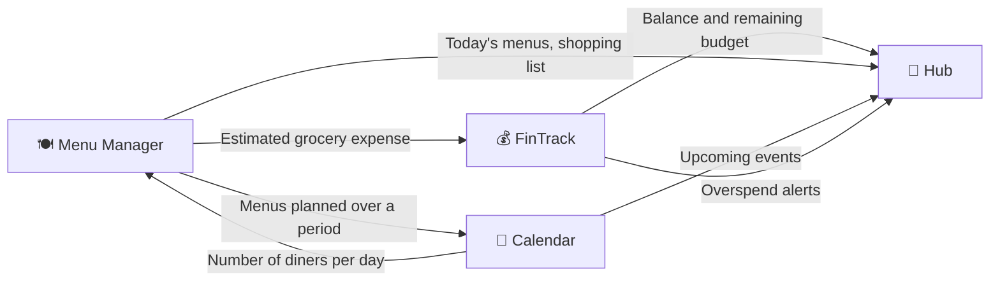

---
tags:
  - project
  - functional-spec
  - saas
  - ideation
created: 2026-09-14
status: draft (functional scope, excludes architecture)
author: Victor
---

# 🧩 SaaS Ecosystem — Functional Specification

> [!NOTE]
> **Vision**
> An ecosystem of four distinct but interconnected SaaS products: a menu and grocery manager, a shareable calendar, FinTrack (personal finance and budgeting), and a bento-box-style hub that aggregates modules from the other three products. Each product is autonomous and can be used on its own. The added value comes from the connections between them, which the user activates explicitly.
>
> Status: portfolio/learning project, with a possible path toward a commercial product. FinTrack has not actually been started yet: this document restarts its functional scope from zero; the existing architecture documentation (ADRs, stack) remains the technical target for later.

---

## 📑 Table of Contents

- [🎯 Framing Principles](#-framing-principles)
- [🔗 Interconnection Model](#-interconnection-model)
- [🍽️ Product 1 — Menu Manager](#-product-1--menu-manager)
- [📅 Product 2 — Calendar](#-product-2--calendar)
- [💰 Product 3 — FinTrack (Finance & Budget)](#-product-3--fintrack-finance--budget)
- [🧱 Product 4 — Hub](#-product-4--hub)
- [🌐 Cross-Cutting Requirements](#-cross-cutting-requirements)
- [🚫 Global Out of Scope for v1](#-global-out-of-scope-for-v1)
- [⚠️ Open Decisions and Risks](#-open-decisions-and-risks)
- [🗺️ Recommended Prioritization](#-recommended-prioritization)
- [➡️ Next Steps](#-next-steps)

---

## 🎯 Framing Principles

| Principle | Decision |
|---|---|
| Product model | 4 functionally separate products (each with its own data and settings), with shared authentication via a Global account (see decision below) |
| Level of detail | The 4 modules are specified at the same functional level in this document, including FinTrack |
| Scope of this document | Functional only: needs, business entities, rules, user flows. No architecture, stack, or technical schema |
| Purpose | Portfolio/learning, with a possible commercial trajectory |

> [!IMPORTANT]
> **Decision: Global account (shared authentication, confirmed)**
> A Global account per user is used to authenticate across all four products. This is not a return to the unified model that was ruled out at the very start: each product keeps its own data and its own settings, automatically initialized with default values on first login to a new platform. What the Global account pools is identity and login, not each product's business data. Details in [🔗 Interconnection Model](#-interconnection-model).

---

## 🔗 Interconnection Model

This is the piece that holds the "ecosystem" together. Without it, these are four applications that don't talk to each other.

> [!IMPORTANT]
> **What the Global account changes here**
> The `Connection` mechanism described in this section no longer serves to make a single user's own products talk to each other: with the Global account, a user who uses Menu Manager, Calendar, and FinTrack already has the same identity everywhere — not four accounts to link. The `Connection`, `Shared period`, and `Continuous calendar access` concepts described in this section remain necessary, but only for sharing **between different users**: a calendar shared with friends, a menu shared within a group, a FinTrack space shared with someone else. This is a simplification compared to the previous version of this section, not an added layer of complexity.

### Principle

Each product exposes **connections**: a user can explicitly authorize product A to read (or write) certain data in product B. Same principle as authorizing a third-party application to access a Google account: a named authorization, with a limited scope, revocable at any time.

- A connection has a **direction** (who reads from whom) and a **scope** (which data, read-only or read/write)
- A product that isn't connected must remain fully usable on its own. The connection is an option, never a mandatory dependency
- A revoked connection must degrade gracefully (the widget or feature that depended on it shows a "not connected" state, not an error)

### Identified Functional Flows

> [!NOTE]
> **Why this direction of flow**
> The Hub only ever receives data as a reader; it never writes into the other products: it's an aggregator, not a source of truth. Menu and Calendar exchange data in both directions because the number of diners on a given day (Calendar) drives the scaling of a menu's quantities (Menu Manager), and a planned menu must appear in the Calendar. Menu writes to FinTrack one-way because a shopping list generates a projected expense, but FinTrack has no need to write back into Menu. For a menu shared in group mode, this arrow actually fans out to several FinTrack instances at once, one per participant, each receiving its share according to the defined split.

### What This Implies for Each Product

- Each product must have a notion of **permissions granted to third parties** (which product, what scope, since when)
- Each product that *receives* data from another must handle the absence or delay of that data without breaking
- The Hub depends entirely on the other three: it only has value if at least one product is connected

---

## 🍽️ Product 1 — Menu Manager

### Objective

Help the user plan meals, generate a shopping list, track their food budget, and follow their diet or weight goals.

### Functional Entities

| Entity | Description |
|---|---|
| `Ingredient` | A single food item: name, unit of measure, nutritional values (kcal, macros) and average weight where available, reference unit price, photo (or a default image based on its product type), product type, allergen/diet tags |
| `Product type` | A visual/general category for the ingredient (meat, drink, alcohol, sweet...), used to pick the default image. A distinct dimension from allergen/diet tags: an ingredient has exactly one product type but can carry several allergen/diet tags |
| `Allergen/diet tag` | A qualitative label (allergen or diet type) assignable to an ingredient, with an associated icon |
| `Meal type` | A meal category (breakfast, lunch, snack, dinner...), customizable. A common set is defined by Victor; each user can add their own custom types. Each type specifies whether it allows multiple occurrences the same day (e.g. a snack) or only one (e.g. lunch) |
| `Dish` | A recipe made of ingredients and quantities, **defined for 1 person** |
| `Menu` (or `Planned meal`) | Association of one or more dishes with a day and a `Meal type` |
| `Shopping list` | Aggregation of ingredients needed over a given period, with quantities scaled accordingly |
| `Goal` | A weight or diet goal tracked over time |
| `Expense split` | For a menu shared in group mode, how the estimated expense is divided among participants before being pushed to FinTrack: equal split by default, or custom (manually defined shares or amounts) |

### Key Features

- [ ] Create and manage an ingredient catalog
- [ ] Import an ingredient's nutritional values (kcal, macros, average weight where available) from an external database instead of re-entering them by hand
- [ ] Assign one or more allergen/diet icons to an ingredient, auto-suggested when the source allows it, otherwise assigned manually
- [ ] Attach a photo to an ingredient, with a default image based on its product type (meat, drink, alcohol, sweet...) when no photo is provided
- [ ] Define and customize one's own meal types, in addition to the common default set
- [ ] Create a dish from ingredients and quantities given for 1 person
- [ ] Plan a dish on a given day and meal type
- [ ] Automatically scale a dish's quantities based on the day's number of diners (data received from Calendar, see [🔗 Interconnection Model](#-interconnection-model))
- [ ] Generate an aggregated shopping list over a period, merging identical ingredients across several dishes
- [ ] Check off items purchased while shopping
- [ ] Track a food budget (estimated from entered unit prices, compared against actual spend once pushed to FinTrack)
- [ ] For a menu shared in group mode, define an expense split among participants (equal or custom) before sending it to FinTrack
- [ ] Define a weight or diet goal and track its progress

### Key Business Rules

- A dish's quantities are **always** entered for 1 person at creation. Any scaling is calculated, never re-entered manually
- The shopping list must merge quantities of the same ingredient used across several dishes over the period, not list duplicates
- If Calendar isn't connected, the default number of diners is 1 (or a value entered manually in Menu Manager)
- A meal type that allows multiple occurrences per day (a snack, for example) never conflicts with itself: the overlapping-menu check described in the Calendar product only applies to types limited to one occurrence per day

### Out of Scope for v1

- AI-based dish recommendations
- Pantry/inventory stock management
- Advanced nutritional tracking (full dietary-app-style detailed macros): staying at the level of a simple weight/diet goal
- MyFitnessPal integration: their developer portal explicitly states they are no longer accepting new API access requests, access being reserved for partnerships (partners@myfitnesspal.com). Not a realistic option for a solo project at this stage
- **v2**: barcode scanning to retrieve a product's full record (description, photo). A natural fit for Open Food Facts, which is precisely built around barcodes
- **After v2, not before**: extracting prices from a paper or digital receipt. Technically feasible (free and open-source OCR with Tesseract, or dedicated APIs like Mindee with a limited free tier), but the difficulty isn't the OCR: it's matching a receipt line abbreviated by the store ("CAR BIO 500G") to a precise ingredient in the catalog. Closer to its own sub-project than a side feature
- **Version not yet defined, not v1**: automatic filtering of dishes compatible with a diet or allergy. Kept in the overall scope, but not needed for v1, and in any case contingent on a user having already tagged their own ingredients in their catalog (see the decision on the allergen/diet dictionary below)

### Open Points

> [!IMPORTANT]
> **Decision: ingredient data source**
> **USDA FoodData Central** as the primary source for nutritional values (kcal, macros): free, public-domain data, no paid tier, free API key (limit of 1000 requests/hour). Covers generic recipe ingredients (carrot, flour, chicken breast), not just branded products. **Open Food Facts** as a complement, later, for packaged products identified by barcode (useful if receipt scanning or precise product tracking is added): free and open, but less suited as a primary source for raw ingredients.
>
> Neither source provides a reliable allergen/diet tag for a generic ingredient: that's not data to import, it's a dictionary to build.

> [!IMPORTANT]
> **Decision: ingredient unit prices**
> A first estimate via API where possible, manual entry by the user otherwise. API angle: **Open Prices** (prices.openfoodfacts.org), a project dedicated to community-sourced food product pricing. It inherits the same limitation as Open Food Facts though: built around barcodes, so relevant for a specific branded product, not guaranteed for a generic raw ingredient ("carrots", with no brand or barcode). In practice, manual entry is likely to be the main path in v1 for a large part of the catalog, not just a fallback

> [!IMPORTANT]
> **Decision: allergen/diet dictionary (confirmed)**
> A common dictionary of tag **definitions** (allergens, diet types), maintained **independently of the ingredient catalog**: it is not a list derived or synced from imported ingredient data (USDA, Open Food Facts). Victor defines this list, evolves it, and assigns the icon for each common tag. Each user can additionally add their own custom tags with their own icon, with no impact on the common dictionary.
>
> **The association of a tag to an ingredient is not pre-filled by the platform in v1.** It's up to each user to assign it in their own catalog, ingredient by ingredient. The platform neither suggests nor presupposes anything, even from API data.

> [!NOTE]
> **Nuance for the v2 barcode feature**
> For a product scanned via Open Food Facts, allergens are real product data (computed from the ingredient list printed on the packaging), not an estimate. Different from the case of raw catalog ingredients just discussed. The "no pre-tagging" principle still holds if we want to stay consistent: even reliable data of this kind would remain a suggestion to be validated by the user, never automatically applied to their catalog.

> [!NOTE]
> **Private → common graduation: pushed to v3/v4**
> An idea worth keeping but not to be specified now: surfacing a suggestion (never an automatic application) into the common dictionary when several users tag the same ingredient the same way. Explicitly pushed to v3 or v4, not before.

> [!IMPORTANT]
> **Decision: "product type" taxonomy (confirmed)**
> Also used to filter and group dishes, not just to pick a default image. Default images are provided by Victor himself, not sourced from Open Food Facts or another API: the licensing question (CC-BY-SA, attribution) is therefore moot.

---

## 📅 Product 2 — Calendar

### Objective

Organize the user's time, with a dedicated view for meal planning, optional synchronization with external calendars, and sharing of periods with other users.

### Functional Entities

| Entity | Description |
|---|---|
| `Event` | A generic event (title, date, time, duration) |
| `Planned day` | A calendar day that, in addition to events, has a number of diners and the meals associated with it |
| `Shared period` | A date range shared by an owner with one or more recipients, with an access level and a selection of the meal types involved (not necessarily all of them). Asymmetric model, confirmed sufficient for group sharing (see decisions below) |
| `Continuous calendar access` | A permanent authorization (not bounded to a period) granted by one user to another to include their entire calendar in a custom view. In v1, no real-time synchronization: the data refreshes on demand |
| `Custom view` | A view defined by the user, combining one or more sources: shared periods and/or continuous calendar access |
| `External calendar connection` | An authorization to import (and, eventually, write) events from a Google, Apple, or other calendar |

### Key Features

- [ ] Create, edit, delete events
- [ ] At least two views: an **organization** view (all event types) and a **menu** view (focused on planned meals)
- [ ] Define a number of diners per day, passed to Menu Manager
- [ ] Display Menu Manager's planned menus directly in the menu view
- [ ] Import events from an external calendar (Google, Apple...) into the organization view
- [ ] Share a calendar period with another user, visible in their own calendar
- [ ] When creating a shared period, select which meal types are included (all, or only some)
- [ ] Create a custom view combining several calendars or shared periods (e.g. a "friends' holiday" view showing only a period shared across several calendars)
- [ ] Grant another user continuous calendar access (permanent, not bounded to a period), revocable at any time
- [ ] Aggregate, in a custom view, all events from one or more calendars in continuous-access mode
- [ ] Manually refresh a view based on continuous access, with the last-refresh timestamp displayed (no real-time sync in v1)
- [ ] Merge, into the personal menu view, menus coming from shared periods the user participates in, to prevent them from planning another meal in the same slot
- [ ] Show a visual indicator on the calendar when a personal menu and a shared menu coexist on the same day and meal type, without ever automatically deleting or replacing either one

### Key Business Rules

- The number of diners for a day is the reference data used by Menu Manager to scale quantities. If it changes after a menu has been planned, the user must be warned that the shopping list needs to be regenerated
- A shared period keeps its original owner: the recipient sees it but doesn't become the owner of the events
- **v1**: only the user who created the share can edit the events of the shared period; the recipient(s) are read-only. **v2**: a permission (roles) system to open editing to other users
- A share is always made for a full date range, never event by event
- Data displayed via continuous calendar access reflects the last requested refresh, not the live real-time state: the displayed timestamp must make this visible, to avoid a user acting on an availability that has changed since
- A meal type not included in a period's share remains strictly private: it does not appear in other participants' menu view, even during the shared period

### Out of Scope for v1

- Real-time synchronization with external calendar providers (v1: refresh on demand, no continuous push)
- Simultaneous collaborative editing on the same event
- Automatic scheduling-conflict resolution between multiple users

### Open Points

> [!IMPORTANT]
> **Decision: continuous calendar access (confirmed)**
> Both types of custom view are kept: one based solely on already-shared periods, another based on continuous (permanent) access to one or more other users' calendars. To limit complexity in v1, continuous access does not sync in real time: the user triggers a manual refresh when they want to see others' up-to-date calendar state. This cleanly separates the question of the **scope of the authorization** (permanent or not) from that of the **sync mechanism** (real-time or on-demand), and avoids building live sync for a v1.

> [!IMPORTANT]
> **Decision: sharing granularity (confirmed)**
> Sharing is always done for a full date range, never event by event.

> [!IMPORTANT]
> **Decision: writing to external calendars (confirmed in principle)**
> Being able to create an event in the ecosystem and have it flow up to an external calendar, not just import read-only. **Google Calendar first**: official REST API, standard OAuth2 authentication, free within generous quotas. Other providers are pushed back with no firm date, to be revisited case by case later, no fixed list for now. Timing confirmed: writing to Google Calendar is a v1 goal, not deferred.

> [!IMPORTANT]
> **Decision: sharing model for "friends' holiday" (confirmed)**
> The asymmetric "shared period" model (one owner, one or more recipients) is sufficient for this case in v1. No symmetric group model to build.

> [!IMPORTANT]
> **Decision: visibility of shared menus in the personal menu view**
> A menu defined within a shared period must appear merged into each participant's personal menu view, not only in the shared-period view, and only for the meal types included in the share. Example: a raclette dinner shared on 10/06/2026 must show up in each participant's "all my menus" view, so none of them unknowingly plans another meal in the same slot. The shared menu remains read-only for participants, consistent with the editing rule already set. The conflict check is based on the (day, meal type) pair, not the day alone: a lunch and a dinner on the same day are not in conflict with each other. A meal type that allows multiple occurrences per day (a snack) is never subject to this check.
>
> **This merge must never overwrite existing data, in either direction.** If a recipient has already planned their own menu for a day by the time a period is shared with them, their personal menu stays intact: nothing is deleted, nothing is automatically replaced. Both coexist, with a visual indicator on the calendar flagging the presence of both a personal and a shared menu in the same slot. The resolution (keep their own, adopt the shared one, or keep both visible) remains a manual decision by the user.

> [!IMPORTANT]
> **Decision: diners and budget for a shared menu (both modes supported)**
> Same logic as for the two calendar view types: both envisioned options are kept, as a choice, rather than a single imposed mode. A **group** mode (a single set of quantities, a single estimated expense, split among participants) and an **individual** mode (each participant makes their own estimate and their own expense on their own FinTrack instance). The default mode is still to be decided at the technical stage.
>
> In group mode, the expense is no longer necessarily carried in full by the creator: a **split** defines how it divides among participants before being sent to FinTrack, equal by default, or custom (manually defined shares or amounts, for cases where not everyone pays the same amount). Each participant receives their share as a forecast in their own FinTrack instance, to be validated by them, consistent with the manual-validation decision above.

---

## 💰 Product 3 — FinTrack (Finance & Budget)

> [!NOTE]
> **Starting point**
> This section carries over the functional scope already defined in the existing FinTrack project plan (spaces, transactions, multi-currency), reworded at the same level as the other products, and adds the budget planning feature requested as a distinct capability. The architecture portion of that plan (microservices, ADRs, stack) remains the technical reference for later; it is not being reconsidered here.

### Functional Entities

| Entity | Description |
|---|---|
| `Space` | A bank account, a savings plan, a budget envelope, or an asset portfolio. An envelope additionally carries a mode (Cap or Goal), a renewal period or a deadline, and an associated alert (see the merge decision below) |
| `Transaction` | A credit or debit on a space, carrying one or more `Transaction tags` (the categorization from the original plan, merged with tags) |
| `Transfer` | A move between two spaces |
| `Space member` | A user with access to a shared space, with a role (owner, editor, viewer) |
| `Envelope history` | A snapshot of an envelope's state at the end of a period (recurrence) or at a given moment while tracking toward a deadline: target amount, amount reached, date, whether exceeded or not |
| `Transaction tag` | A free-form label placed on a transaction, independent of the space it occurs in. Unrelated to Menu Manager's allergen/diet tags — a pure naming coincidence between the two products |
| `Tag-based budget tracking` | A lightweight form of tracking, with no envelope and no money moved: a target (Cap or Goal mode, recurrence or deadline) calculated by summing transactions carrying a given tag, regardless of which space they're in |

### Key Features

- [ ] Create spaces of all types (account, savings, envelope, portfolio)
- [ ] Credit/debit a space, with categorization
- [ ] Share a space between users with roles
- [ ] Multi-currency support: fiat, crypto, stocks, with real-time rates
- [ ] Transfers between spaces
- [ ] Consolidated dashboard (global net worth)
- [ ] Transaction history, each transaction able to carry one or more tags
- [ ] Receive an estimated expense pushed by Menu Manager and reconcile it against an actual expense once validated
- [ ] Define, on an envelope, a mode (Cap or Goal) and either a recurrence (monthly, weekly...) or a fixed deadline
- [ ] Keep a browsable history of each elapsed period, or of the progress toward a deadline, for an envelope: target amount, amount reached, whether exceeded or not
- [ ] Tag a transaction with one or more custom tags, independent of the space it's in
- [ ] Create a lightweight tag-based budget tracker (Cap or Goal mode, recurrence or deadline, history), without creating an envelope or moving money
- [ ] Automatically apply an envelope's tag to any transaction credited or debited on it, without preventing additional tags from being added

> [!IMPORTANT]
> **Decision: envelope / budget planning merge, refined into two modes**
> The budget envelope (`BudgetEnvelope`) carries the tracking logic, with a **mode** chosen at creation:
>
> - **Cap**: an amount not to be exceeded (e.g. "Groceries: €300/month"). The balance follows cumulative spending; exceeding the cap is the alert signal
> - **Goal**: an amount to reach, which can be exceeded without that being a problem (e.g. "Vacation savings: €1000"). Reaching or exceeding the goal is positive
>
> In both modes, incoming and outgoing transactions apply normally: a Cap envelope can receive a refund (credit) that reduces cumulative spending, a Goal envelope can also be debited (a withdrawal that moves it away from the target). What changes between the two modes is whether "exceeding" is good or bad news, not the transaction mechanics themselves.
>
> **What remains open, this time with a concrete example**: imagine Victor doesn't want to spend more than €300 on Groceries this month, but without creating an envelope or transferring €300 into it. His money stays in his checking account, he spends normally with his card, and he just wants FinTrack to add up transactions tagged "Groceries" and alert him if the total exceeds €300 this month. No envelope exists, no money moves: it's a calculation over transactions that are already there, not a separate space with its own balance.
>
> This is precisely the case the merge doesn't cover, since both the Cap and Goal modes described here are carried by an envelope, meaning by money actually sitting somewhere.

> [!IMPORTANT]
> **Decision: tag-based budget tracking (confirmed)**
> This lightweight tracking is kept alongside envelopes, not instead of them. A `Tag-based budget tracker` works like an envelope (Cap or Goal mode, recurrence or deadline, history, same display rules: remaining or cumulative for Cap, never negative for Goal), except it has no balance of its own: its value is calculated by summing all transactions carrying a given tag, regardless of which space they're in. "Groceries ≤ €300 this month" becomes: sum of transactions tagged "Groceries" for the current month, compared against €300.
>
> [!IMPORTANT]
> **Decision: category = tag, multi-valued (confirmed)**
> The "category" field originally planned on `Transaction` in the original FinTrack plan and the budget-tracking tag are the same thing: one system, not two. A transaction can carry several tags at once (e.g. "Groceries" and "Organic"). This changes the data model compared to the original plan: a many-to-many relationship between `Transaction` and `Transaction tag`, not a simple single-value category field.
>
> Keeping both mechanisms is a deliberate choice, not a redundancy to fix: the envelope is an **automation** (money actually set aside, a discipline enforced), the tag is a **filtering and history** tool (reviewing spending over a longer period, without necessarily a dedicated envelope behind it).
>
> **Link between the two**: when a transaction is credited or debited on an envelope, it automatically receives the tag corresponding to that envelope (by default, the envelope's name). This avoids duplicating information in two places, and makes tag-based tracking usable to review an envelope's history too, not just non-envelope spending. The user can add other tags on top of this same transaction.
>
> A point not to confuse later at the technical level: an envelope's balance and history are calculated from its direct relationship with its transactions, never from the tag. The auto-assigned tag is only a derived label for filtering: deleting it must never desynchronize the envelope's own tracking.

> [!IMPORTANT]
> **Decision: recurrence or deadline (confirmed)**
> Both modes, Cap and Goal, can each be configured with either a **recurrence** (periodic reset: monthly, weekly...) or a fixed **deadline**, chosen when the space is created. No fixed pairing between a mode and a type of schedule.
>
> In all cases, a history keeps the state of each elapsed period (or the progress toward the deadline): target amount, amount reached, end date, whether exceeded or not. Without history, a recurrence that resets the counter to zero would erase the only record of what happened in the previous period.

> [!IMPORTANT]
> **Decision: Cap mode display**
> Both formats are supported: a **remaining** display (can go negative once the cap is exceeded, e.g. -15/250 for €265 spent out of €250) and a **cumulative** display (e.g. 265/250 for the same case). In both cases, a visual indicator distinct from the number itself signals the overrun. The choice of format is a global user setting, not an option specific to each envelope.

> [!IMPORTANT]
> **Decision: Goal mode display**
> Never displays a negative value. Only the **cumulative/target** format is used (e.g. 1200/1000 for an exceeded goal), never a "remaining to reach" figure that would go negative once the target is exceeded. Consistent with the mode's principle: exceeding a goal is good news, displaying it as negative would make it read as bad news.

### Out of Scope for v1

- Direct bank connections (Open Banking / PSD2)
- Native mobile application
- AI-based automatic categorization

### Open Points

> [!IMPORTANT]
> **Decision: manual validation of expenses pushed to FinTrack (confirmed)**
> An expense estimated by Menu Manager remains a forecast until the user validates it. A transaction is never automatically created in FinTrack without an explicit action on their part.

---

## 🧱 Product 4 — Hub

### Objective

A customizable bento-box-style dashboard, where the user composes widgets fed by connected products.

### Functional Entities

| Entity | Description |
|---|---|
| `Widget` | A display unit, tied to a source product and a data type (e.g. "this week's budget") |
| `Layout` | A user's customized arrangement of widgets in the grid |
| `Connection` | The authorization link to a source product, reused from [🔗 Interconnection Model](#-interconnection-model) |

### Key Features

- [ ] Add, remove, rearrange widgets in a customizable grid
- [ ] Widget catalog by source product: remaining budget and alerts (FinTrack), today's menus and shopping list (Menu Manager), upcoming events (Calendar)
- [ ] A widget whose source product isn't connected shows a "not connected" state with an action to connect, rather than disappearing or failing silently
- [ ] Serve as the central entry point for managing the Global account, connections between products, and ecosystem-wide settings

### Key Business Rules

- The Hub does not store business data, only display configuration and, where applicable, a read cache of the data shown
- A widget degrades gracefully ("not connected" or "data unavailable" state) rather than breaking the whole grid

### Out of Scope for v1

- Third-party widget marketplace
- Widgets coming from applications outside the ecosystem
- Fully free-form, pixel-level layout: a grid with predefined block sizes is enough

### Open Points

> [!IMPORTANT]
> **Decision: Hub is free and included, central management point (confirmed)**
> The Hub is free and included by default, not a separate paid product. It is also the central entry point for managing the Global account, connections between products, and ecosystem-wide settings: this is where a user is redirected for that, not from each product separately.
>
> Content and widgets are assumed to evolve progressively rather than being fixed from the start.

---

## 🌐 Cross-Cutting Requirements

- **Accounts and connections**: unified authentication via one Global account per user, data and settings specific to each product, initialized with defaults on first login (see [🎯 Framing Principles](#-framing-principles)). The connection mechanism described in [🔗 Interconnection Model](#-interconnection-model) now serves only for sharing between different users, not for linking one user's own products together
- **Notifications**: each product must be able to notify the user about its own events (budget overrun, shared calendar period, shopping list ready). Cross-product notification routing (e.g. a FinTrack alert visible in the Hub) is still to be specified at the architecture stage
- **Language**: English as the primary language, with a French option. Correction of an assumption made in an earlier version of this document (I had inferred "French" from the fact that this exchange happens in French, not from an actual decision on your part)
- **Account tiers**: products are free at launch. Permission tiers will come later on the Global account (free, premium, tester, admin), no per-tier feature breakdown at this stage
- **Admin panel**: a dedicated interface to manage all ecosystem users, accessible to admin-tier accounts
- **GDPR / privacy**: to be taken seriously from the design stage if the commercial trajectory is confirmed, especially for FinTrack (financial data) and calendar sharing (data concerning third parties). Not a topic to push to the technical phase — data model choices depend on it. Confirmed: data stays specific to each product (consistent with the Global account only pooling authentication), partly to make per-product encryption easier. Direct consequence: billing AND privacy policies also stay specific to each product, not pooled by the Global account. Particular care needed when drafting these policies when the time comes, one per product

## 🚫 Global Out of Scope for v1

- Native mobile application and desktop client for any of the four products, considered for v2 if feasible
- Public API open to third-party developers
- Unified multi-product billing (each product keeps, for now, its own pricing logic if commercialized; the Global account unifies authentication, not necessarily billing — see open points)

---

## ⚠️ Open Decisions and Risks

> [!WARNING]
> **Scope risk (knowingly accepted)**
> Four distinct functional products, an interconnection layer (Global account, cross-user connections) to build on top, and a level of detail that has clearly grown past a simple MVP over the course of this document (envelope modes, tags, custom views, expense splitting, account tiers, admin panel...). Several quarters of solo work, not several weeks. Explicitly accepted as a long-term project where complexity isn't a blocker: this observation stays in the document so the prioritization below keeps its meaning, not as an objection to resolve.

> [!WARNING]
> **Separate products + commercial trajectory (partially resolved)**
> The Global account settles the authentication/onboarding part of this risk: no more need to maintain four separate signup flows. What it doesn't automatically settle: billing (a Global account could very well pay for only one product out of four) and privacy policies (since data stays specific to each product). If commercialization is confirmed, these two points still need to be decided separately, not absorbed by the Global account decision.

No major point left undecided at this stage: the last four open points (product type, Google Calendar write timing, Cap mode display format, per-product billing/privacy) have all been resolved in this exchange. This section will fill up again as future discussions progress.

---

## 🗺️ Recommended Prioritization

A recommendation, with the reasoning, rather than a list of open options:

1. **Menu Manager and Calendar**: treated as a shared foundation rather than two separate priorities, given how tightly coupled they turned out to be throughout this document (Calendar's number of diners drives Menu Manager's scaling, a shared menu must appear in both, expense splitting flows through both). Building one without the other would mean reworking this dependency later
2. **FinTrack**: the most advanced on the architecture side (ADRs, stack already written), but its functional richness mainly comes from what Menu Manager pushes into it as expenses. Building it after Menu Manager and Calendar gives it a real use case to plug into, rather than an isolated product populated by hand for testing
3. **Hub**: always last, by construction. A hub aggregating empty products has nothing to show, either to you or to a future recruiter or client

---

## ➡️ Next Steps

- [ ] Resolve the open points listed above, at least the ones touching the data model (Menu → FinTrack expense, calendar sharing)
- [ ] Once this specification is validated, move to the technical/architecture phase (ADRs) for Menu Manager, Calendar, and Hub, in the same format already used for FinTrack
- [ ] Technically specify the interconnection model (how separate services authorize each other and exchange data: dedicated authorization provider, webhooks, shared API gateway...) — probably the single most structuring architecture decision in the whole ecosystem

---

_Document generated on 2026-09-14 — SaaS Ecosystem, functional specification v1_

## 🔗 Links

- Technical specification: [Ecosystem SaaS - Technical Specification](technical-specification.md)
- Development backlog: [daily-system - Backlog](https://github.com/Kiilse/daily-system/issues)
