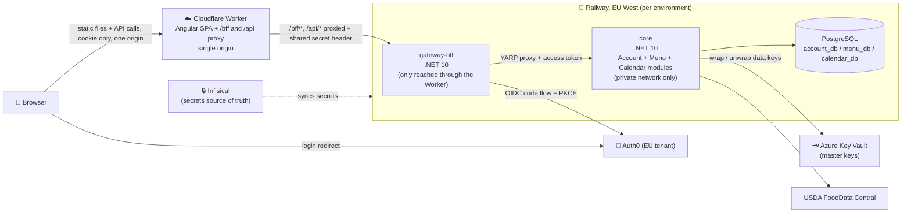
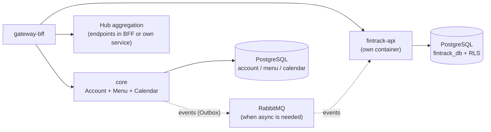
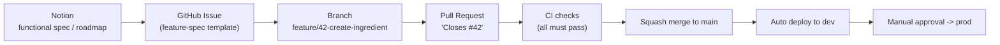
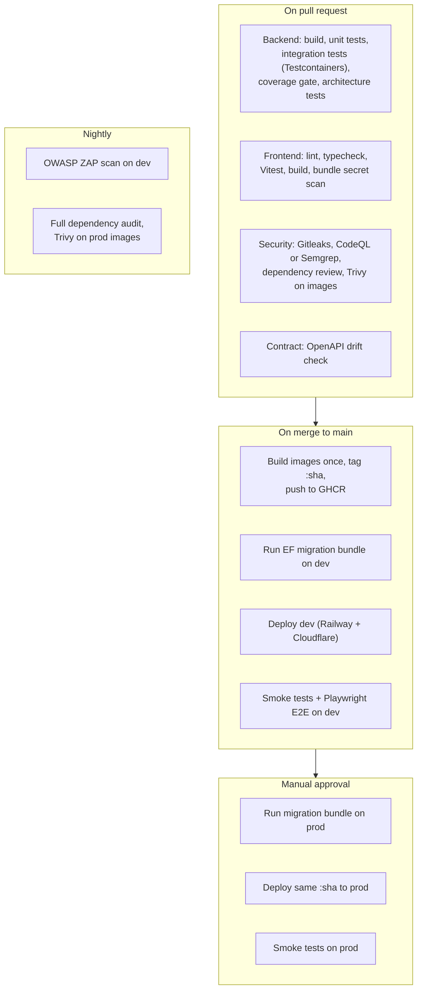
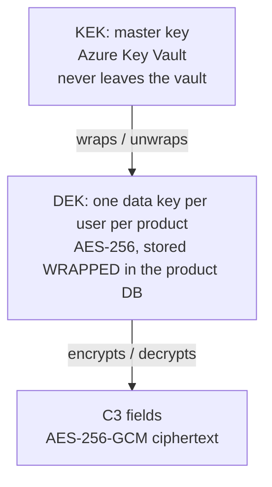
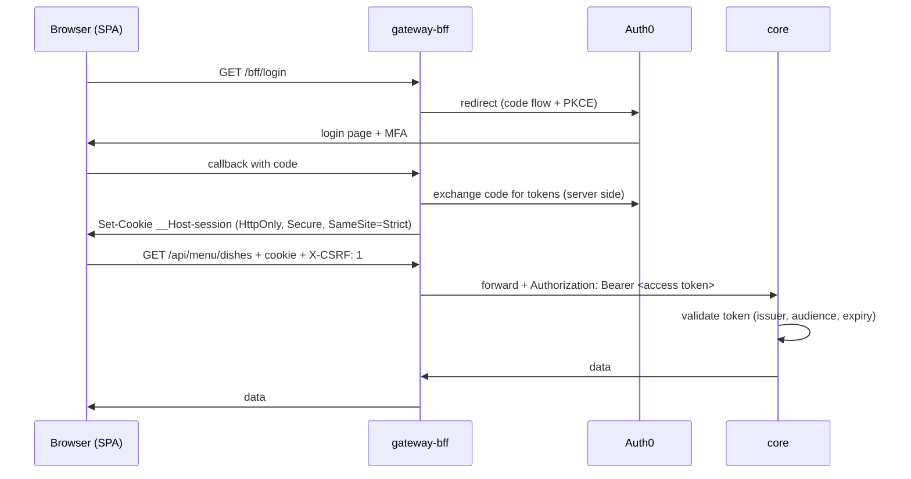

---
tags:
  - project
  - technical-spec
  - saas
  - architecture
created: 2026-09-25
status: draft v1 (awaiting validation of open questions)
author: Victor
related: "[Ecosystem SaaS - Functional Specification](functional-specification.md)"
---

# 🏗️ SaaS Ecosystem: Technical Specification

> [!NOTE]
> **Purpose**
> This document defines the technical architecture of the whole ecosystem (Menu Manager, Calendar, FinTrack, Hub, Global account) and of each product. It turns the [Ecosystem SaaS - Functional Specification](functional-specification.md) into buildable decisions. Every structuring decision has its own ADR in the `ADR/` folder; this document summarizes them and links to them.
>
> Scope of v1 as defined here: the foundation (repository, CI/CD, security, identity, deployment) and a first vertical slice of Menu Manager and Calendar. FinTrack and Hub are specified at the architecture level so that v1 choices don't block them, but they are not built in v1.

> [!WARNING]
> **Constraints that shape everything**
> | Constraint | Value | Consequence |
> |---|---|---|
> | Time budget | 2 weeks, ~10 h/day (~140 h) | v1 = foundation + thin slice, not the full functional scope |
> | Hosting budget | 20 €/month maximum | Few deployable units; Menu, Calendar and Account share one process in v1 |
> | Data | Real user data from day one | Security baseline is mandatory from the first deployment, not a later phase |
> | Region | EU only | Railway EU West (Amsterdam), Auth0 EU tenant, EU regions everywhere possible |
> | Team | 1 developer | Automation replaces human review; simplicity beats theoretical scalability |

---

## 📑 Table of Contents

- [🗺️ Global Architecture](#-global-architecture)
- [📁 Repository Structure](#-repository-structure)
- [🔀 Git Workflow and Tickets](#-git-workflow-and-tickets)
- [🚀 CI/CD Pipeline](#-cicd-pipeline)
- [🌍 Environments and Hosting](#-environments-and-hosting)
- [🔐 Security Architecture](#-security-architecture)
- [🧪 Testing Strategy](#-testing-strategy)
- [📈 Observability](#-observability)
- [🧩 Per-Product Architecture](#-per-product-architecture)
- [🗓️ Two-Week Plan](#-two-week-plan)
- [⚠️ Risks and Points to Verify](#-risks-and-points-to-verify)
- [✅ Resolved Questions](#-resolved-questions)
- [📚 ADR Index](#-adr-index)

---

## 🗺️ Global Architecture

### Principles

1. **Modular monolith first.** Each product is a module with hard boundaries (own database, own code, public contracts only). Modules can be co-hosted in one process or split into separate services without rewriting business code. See [ADR-001 Modular monolith with co-hosted modules in v1](../adr/adr-001-modular-monolith-with-co-hosted-modules-in-v1.md).
2. **Deployment topology is a cost decision, not an architecture decision.** In v1, Account, Menu and Calendar run in a single container (`core`). FinTrack will get its own container when it starts, because its security requirements (RLS, stricter access) justify isolation.
3. **The browser never holds a token.** All authentication goes through a Backend For Frontend (BFF). See [ADR-009 BFF pattern with ASP.NET Core and YARP](../adr/adr-009-bff-pattern-with-asp-net-core-and-yarp.md).
4. **Sensitive data is encrypted by the application, keys live outside the hosting platform.** See [ADR-010 Field-level envelope encryption with Azure Key Vault](../adr/adr-010-field-level-envelope-encryption-with-azure-key-vault.md).
5. **Everything that can be checked by a machine is checked in CI**, because there is no second reviewer.

### v1 runtime view



> [!NOTE]
> **Why three services and not one**
> - `gateway-bff` is the only backend reachable from outside, and only through the Cloudflare Worker. It handles login, cookies, CSRF and rate limiting, and forwards calls. If it is compromised, it holds no business logic and no database credentials.
> - `core` is reachable only through Railway's private network. It validates the access token itself anyway (zero trust: being on the private network is not a proof of identity).
> - One PostgreSQL instance holds one database per product, each with its own database role. That keeps the "data specific to each product" rule from the functional spec at the database level, for the price of a single instance.

### Target view (after FinTrack and Hub)



### Technology stack

| Layer | Choice | Version | ADR |
|---|---|---|---|
| Backend | .NET, ASP.NET Core Minimal APIs | .NET 10 (LTS, supported until Nov 2028) | [ADR-007 Internal architecture per module](../adr/adr-007-internal-architecture-per-module.md) |
| ORM | EF Core + Npgsql | 10.x | [ADR-006 PostgreSQL with one database per product](../adr/adr-006-postgresql-with-one-database-per-product.md) |
| Database | PostgreSQL | 17 or current Railway template | [ADR-006 PostgreSQL with one database per product](../adr/adr-006-postgresql-with-one-database-per-product.md) |
| BFF / proxy | ASP.NET Core cookie + OpenID Connect handlers, YARP | 10.x | [ADR-009 BFF pattern with ASP.NET Core and YARP](../adr/adr-009-bff-pattern-with-asp-net-core-and-yarp.md) |
| Frontend | Angular (standalone, signals, zoneless), TypeScript strict | Angular 22 | [ADR-015 Angular SPA single frontend](../adr/adr-015-angular-spa-single-frontend.md) |
| Identity | Auth0 (managed), one tenant per environment | Free plan | [ADR-008 Managed identity provider Auth0](../adr/adr-008-managed-identity-provider-auth0.md) |
| Secrets | Infisical Cloud (EU) | Free plan | [ADR-011 Secrets management with Infisical](../adr/adr-011-secrets-management-with-infisical.md) |
| Encryption keys | Azure Key Vault Standard | Pay per operation | [ADR-010 Field-level envelope encryption with Azure Key Vault](../adr/adr-010-field-level-envelope-encryption-with-azure-key-vault.md) |
| Backend hosting | Railway, EU West (Amsterdam) | Hobby plan | [ADR-005 Hosting topology and budget](../adr/adr-005-hosting-topology-and-budget.md) |
| Frontend hosting | Cloudflare Workers (static assets, SPA mode) | Free plan | [ADR-005 Hosting topology and budget](../adr/adr-005-hosting-topology-and-budget.md) |
| CI/CD | GitHub Actions, GHCR for images | | [ADR-004 CI-CD with build once deploy many and manual production approval](../adr/adr-004-ci-cd-with-build-once-deploy-many-and-manual-production-approval.md) |
| Observability | OpenTelemetry, Grafana Cloud, Sentry | Free tiers | [ADR-019 Observability with OpenTelemetry Grafana Cloud and Sentry](../adr/adr-019-observability-with-opentelemetry-grafana-cloud-and-sentry.md) |

---

## 📁 Repository Structure

One repository for the whole ecosystem. See [ADR-002 Monorepo](../adr/adr-002-monorepo.md).

```text
ecosystem/
├── .github/
│   ├── workflows/
│   │   ├── ci-backend.yml          # build, unit + integration tests, coverage, arch tests
│   │   ├── ci-frontend.yml         # lint, typecheck, vitest, build, bundle scan
│   │   ├── security.yml            # gitleaks, CodeQL/Semgrep, dependency review, Trivy
│   │   ├── deploy.yml              # main -> dev (auto) -> prod (manual approval)
│   │   └── nightly.yml             # ZAP DAST on dev, full dependency audit
│   ├── ISSUE_TEMPLATE/feature-spec.yml
│   ├── pull_request_template.md
│   ├── CODEOWNERS
│   └── dependabot.yml
├── docs/
│   ├── adr/                        # ADR copies versioned with the code
│   └── specs/
├── src/
│   ├── backend/
│   │   ├── Ecosystem.slnx
│   │   ├── Directory.Build.props   # shared settings: nullable, warnings as errors, analyzers
│   │   ├── Directory.Packages.props# central package versions
│   │   ├── BuildingBlocks/
│   │   │   ├── SharedKernel/       # Result, errors, Money, strongly typed IDs
│   │   │   ├── Security/           # encryption service, blind index, current user
│   │   │   ├── Persistence/        # EF conventions, interceptors, audit
│   │   │   └── Web/                # problem details, auth policies, OpenAPI setup
│   │   ├── Gateway.Bff/
│   │   ├── Host.Core/              # composition root: hosts Account, Menu, Calendar
│   │   └── Modules/
│   │       ├── Account/
│   │       │   ├── Account/                # features + domain + infrastructure
│   │       │   └── Account.Contracts/      # public interfaces and DTOs only
│   │       ├── Menu/
│   │       │   ├── Menu/
│   │       │   └── Menu.Contracts/
│   │       ├── Calendar/
│   │       │   ├── Calendar/
│   │       │   └── Calendar.Contracts/
│   │       └── FinTrack/                   # phase 3, Clean Architecture layout
│   │           ├── FinTrack.Domain/
│   │           ├── FinTrack.Application/
│   │           ├── FinTrack.Infrastructure/
│   │           ├── FinTrack.Api/
│   │           └── FinTrack.Contracts/
│   │   └── tests/
│   │       ├── Architecture.Tests/
│   │       ├── Menu.UnitTests/  Menu.IntegrationTests/
│   │       ├── Calendar.UnitTests/  Calendar.IntegrationTests/
│   │       └── ...
│   └── frontend/                   # Angular CLI workspace
│       ├── projects/
│       │   ├── app/                # the single SPA (shell, routing)
│       │   ├── core/               # auth state, HTTP interceptors, error handling
│       │   ├── ui/                 # design system components
│       │   ├── api-clients/        # generated from OpenAPI, never edited by hand
│       │   ├── feature-menu/
│       │   └── feature-calendar/
│       └── e2e/                    # Playwright
├── infra/
│   ├── docker-compose.yml          # local: postgres, bff, core, (later rabbitmq)
│   └── railway/                    # railway.json per service
└── tools/
    ├── generate-clients.sh
    └── scan-bundle.sh
```

> [!IMPORTANT]
> **Module boundary rules (enforced by `Architecture.Tests`)**
> - A module can reference another module's `*.Contracts` project, never its implementation.
> - `*.Contracts` projects reference nothing except `SharedKernel`.
> - A module never reads another module's database. It asks through a contract.
> - Domain code does not reference EF Core, ASP.NET Core or any infrastructure package.
>
> These rules are what make "split into a separate service later" a deployment change instead of a rewrite.

---

## 🔀 Git Workflow and Tickets

See [ADR-003 GitHub Flow with short-lived feature branches and feature flags](../adr/adr-003-github-flow-with-short-lived-feature-branches-and-feature-flags.md).

### Flow



### Rules

| Rule | Value |
|---|---|
| Branch model | GitHub Flow: `main` is always deployable |
| One feature | One issue, one branch, one PR |
| Branch naming | `feature/<issue>-<slug>`, `fix/<issue>-<slug>`, `chore/<slug>` |
| Branch lifetime | Target ≤ 3 days. A longer feature is split into several issues, unfinished parts hidden behind a feature flag |
| Commits | Conventional Commits (`feat(menu): ...`, `fix(calendar): ...`) |
| Merge | Squash merge only, linear history |
| `main` protection | PR required, all status checks required, no force push, no direct push, branch up to date before merge |
| Feature flags | `Microsoft.FeatureManagement` on the backend, flags exposed read-only to the SPA through the BFF |
| Notion link | GitHub Issues remain the execution source. Notion holds specs and roadmap, synced with the Notion GitHub integration |

### Feature-spec issue template (content)

1. **User story**: As a ..., I want ..., so that ...
2. **Link** to the functional spec section
3. **Acceptance criteria** in Given / When / Then form
4. **Test cases** (unit, integration, E2E) derived from the criteria
5. **Data classification** of new fields (C0 to C3, see security section)
6. **Security considerations** (authorization rule, input validation, sharing between users)
7. **Feature flag** name if the feature spans several PRs
8. **Out of scope**

### Definition of Done

- [ ] Acceptance criteria covered by automated tests
- [ ] CI green (tests, coverage gate, architecture tests, all security scans)
- [ ] OpenAPI contract and generated TS client up to date
- [ ] Sensitive fields encrypted according to their classification
- [ ] No new secret, no PII in logs
- [ ] Deployed to dev and checked there
- [ ] ADR written if a structuring decision was made

---

## 🚀 CI/CD Pipeline

See [ADR-004 CI-CD with build once deploy many and manual production approval](../adr/adr-004-ci-cd-with-build-once-deploy-many-and-manual-production-approval.md).

**Continuous delivery**, not continuous deployment: every merge to `main` produces a release candidate that is automatically deployed to dev. Production is one click away, behind a GitHub Environment with a required reviewer (you).

**Build once, deploy many**: the Docker image is built once per commit, tagged with the commit SHA, pushed to GitHub Container Registry, and the same image is promoted from dev to prod. Prod never runs something that wasn't tested in dev.



| Topic | Decision |
|---|---|
| Path filters | Backend jobs run only when `src/backend/**` changes, frontend jobs only when `src/frontend/**` changes. Security jobs always run |
| Migrations | EF Core migration bundles (a self-contained executable) run as a pipeline step with a dedicated migration role. Runtime role cannot alter the schema |
| Migration safety | Expand/contract pattern: a change that breaks the previous version is split across two releases, so a rollback to the previous image always works |
| Rollback | Redeploy the previous image SHA. No rebuild |
| Supply chain | GitHub Actions pinned by commit SHA, Docker base images pinned by digest, Dependabot keeps them updated |
| Secrets in CI | Injected from Infisical, never written in workflow files |

---

## 🌍 Environments and Hosting

See [ADR-005 Hosting topology and budget](../adr/adr-005-hosting-topology-and-budget.md) and [ADR-018 Environments and configuration](../adr/adr-018-environments-and-configuration.md).

| Environment | Where | Purpose | Data |
|---|---|---|---|
| `local` | Your machine, `docker compose` | Development and debugging | Generated seed data |
| `dev` | Railway environment `dev` + Cloudflare Worker (dev) + Auth0 dev tenant | Integration target of every merge, E2E tests, DAST | Generated data only |
| `prod` | Railway environment `prod` + Cloudflare Worker (prod) + Auth0 prod tenant | Real users | Real data |

> [!IMPORTANT]
> **Non-negotiable**
> Production data never leaves production. No dump of prod into dev or local, ever. Dev uses generated data.

### Domains and single origin

No domain name is chosen yet, and the architecture must work without one. See [ADR-009 BFF pattern with ASP.NET Core and YARP](../adr/adr-009-bff-pattern-with-asp-net-core-and-yarp.md).

**The problem**: without a custom domain, the SPA lives on `*.workers.dev` and the BFF on `*.up.railway.app`. These are two different **sites** for the browser (both suffixes are on the Public Suffix List, the list browsers use to decide what counts as one site). A session cookie set by the BFF would then be a third-party cookie, which modern browsers block or restrict. The BFF would not work.

**The solution**: the Cloudflare Worker that serves the SPA also **proxies `/bff/*` and `/api/*` to the Railway BFF**. For the browser, everything comes from one origin. Consequences:

- The session cookie is first-party and `SameSite=Strict`, with or without a custom domain.
- No CORS configuration at all, since there is no cross-origin call.
- The Worker adds a secret header on proxied requests; the BFF rejects requests without it, so its Railway URL is useless if someone finds it.
- When a domain is bought, it is attached to the Worker (`app.<domain>`) and to Auth0 (`auth.<domain>`) with no code change.

| Environment | SPA + API origin | Identity |
|---|---|---|
| dev | `<name>-dev.<account>.workers.dev` (then `dev.<domain>`) | Auth0 dev tenant domain (then `auth-dev.<domain>`) |
| prod | `<name>.<account>.workers.dev` (then `app.<domain>`) | Auth0 prod tenant domain (then `auth.<domain>`) |

### Budget estimate (to verify after the first week of real usage)

Railway bills RAM at $10/GB/month and CPU at $20/vCPU/month, per minute of actual use.

| Service | Env | RAM target | Estimate/month |
|---|---|---|---|
| `gateway-bff` | prod | ~150 MB | ~$2 |
| `core` | prod | ~300 MB | ~$3.5 |
| PostgreSQL | prod | ~200 MB | ~$2.5 |
| `gateway-bff` + `core` | dev (serverless, sleeps when idle) | idle most of the time | ~$1 to 2 |
| PostgreSQL | dev (databases don't sleep) | ~150 MB | ~$2 |
| CPU (all, mostly idle) | | | ~$2 to 4 |
| Volumes + backups | | < 2 GB | < $1 |
| **Total Railway** | | | **~$13 to 17** (Hobby plan: $5 fee includes $5 of usage) |
| Azure Key Vault | | pay per 10k operations | < $1 |
| Cloudflare, Auth0, Infisical, Grafana Cloud, Sentry | | free tiers | $0 |

> [!TIP]
> **Keeping .NET memory low**
> .NET defaults to **Server GC**, which reserves memory per CPU core for throughput. On a small container this wastes RAM you pay for. Set `<ServerGarbageCollector>false</ServerGarbageCollector>` and `<ConcurrentGarbageCollection>false</ConcurrentGarbageCollection>` in the host projects, and consider `DOTNET_GCHeapHardLimit` to cap the heap. Use the `aspnet:10.0-noble-chiseled` base image (no shell, no package manager, non-root by default).

> [!WARNING]
> **Serverless caveat on dev**
> Railway only puts a service to sleep when it stops sending outbound traffic. Telemetry exporters and database connection pools keep it awake. On dev: disable telemetry export when idle or use a long export interval, and let Npgsql prune idle connections.

---

## 🔐 Security Architecture

### Threat model (what we defend against)

| Threat | Defense |
|---|---|
| Stolen disk, volume or backup | Encryption at rest by the host (to verify, see risks) + application-level encryption of sensitive fields |
| Database dump leaked (SQL injection, misconfiguration, stolen credentials) | Application-level encryption: the dump contains ciphertext for C3 fields, and the keys are not in the database nor on Railway |
| Token theft through XSS in the SPA | BFF: no token in the browser, only an `HttpOnly` cookie JavaScript cannot read. Strict CSP limits XSS in the first place |
| CSRF | `SameSite=Strict` cookie + mandatory custom header `X-CSRF: 1` on every API call (a cross-site page cannot add a custom header without a CORS preflight, which the BFF never approves) |
| A user reading another user's data | Authorization checks in every handler + EF Core global query filters (v1) + PostgreSQL Row-Level Security (FinTrack) |
| Secret committed to Git or shipped in the front bundle | Gitleaks pre-commit hook + in CI, GitHub push protection, bundle scan after build |
| Vulnerable dependency or base image | Dependabot, dependency review, `dotnet list package --vulnerable`, `npm audit`, Trivy |
| Code-level vulnerability | CodeQL (public repo) or Semgrep CE (private repo), Roslyn security analyzers |
| Running app vulnerability | OWASP ZAP scan on dev every night |
| Account takeover | Auth0 MFA (mandatory for admin tier and FinTrack, strongly suggested otherwise), breached password detection, brute-force protection |

**Out of scope, deliberately**: protecting data from you, the administrator (end-to-end encryption). It would make server-side sums, search and sharing impossible.

### Data classification

Every new field in a ticket gets a class. The class decides the protection.

| Class | Meaning | Examples | Protection |
|---|---|---|---|
| C0 | Public | Default meal types, product types | None |
| C1 | Internal | IDs, timestamps, amounts, tags, dates | Access control only (needed for sums, filters, sorting) |
| C2 | Personal | Email, display name, allergen tags on own ingredients | Access control, never logged. Email encrypted + blind index |
| C3 | Sensitive | Transaction labels and notes, space names, event titles and details, weight and diet goals, Google OAuth refresh tokens | Application-level encryption (AES-256-GCM, per-user key) |

> [!WARNING]
> **Weight and diet goals are health data**
> Under GDPR, health data is a special category (Article 9). A weight goal counts. It needs explicit consent at the moment the user creates a goal, and it is classified C3.

### Encryption design

See [ADR-010 Field-level envelope encryption with Azure Key Vault](../adr/adr-010-field-level-envelope-encryption-with-azure-key-vault.md).



- **Envelope encryption**: the data is encrypted with a data key (DEK). The DEK is itself encrypted ("wrapped") by a master key (KEK) that stays in Azure Key Vault. The database only ever stores the wrapped DEK. A database dump is useless without calling Key Vault.
- **Per-user DEK**: deleting a user's DEK makes all their encrypted data unreadable at once (**crypto-shredding**), which implements the GDPR right to erasure even for data you can't find row by row.
- **Unwrapped DEKs are cached in memory** for a few minutes to avoid calling Key Vault on every request (latency and cost).
- **Ciphertext format**: `version (1 byte) | key id | nonce (12 bytes) | tag (16 bytes) | ciphertext`, stored as `bytea`. The version byte allows changing the algorithm later without ambiguity.
- **Blind index** for fields that must be searchable by equality (email for sharing invitations): store `HMAC-SHA256(secret, normalized email)` next to the ciphertext. You can find "who has this email" without being able to read emails.
- **KEK rotation** only re-wraps DEKs, it never re-encrypts the data.

> [!NOTE]
> **Honest limit of crypto-shredding**
> Railway backups keep old copies of the wrapped DEK for up to 89 days. Erasure is therefore complete once the backup retention has expired. This must be written in each product's privacy policy.

### BFF and session

See [ADR-009 BFF pattern with ASP.NET Core and YARP](../adr/adr-009-bff-pattern-with-asp-net-core-and-yarp.md).



- Tokens are stored server-side in the encrypted session cookie. ASP.NET Core **Data Protection keys** (which encrypt that cookie) are persisted in PostgreSQL and protected with Key Vault, otherwise every restart would log everybody out.
- The BFF refreshes access tokens itself.
- No CORS: the SPA and the BFF share one origin through the Cloudflare Worker. The BFF rejects any request missing the Worker's secret header.
- Rate limiting (ASP.NET Core rate limiter) on the BFF, stricter on auth endpoints.

### Secrets

See [ADR-011 Secrets management with Infisical](../adr/adr-011-secrets-management-with-infisical.md).

- **Infisical (EU cloud) is the single source of truth** for secrets. It syncs them into Railway variables and GitHub Actions secrets. You never paste a secret by hand in two places.
- The repository contains only `.env.example` files with empty values.
- The SPA contains no secret at all, by design (BFF). Its build-time config holds only public values (API base URL, feature flag defaults).
- `tools/scan-bundle.sh` runs Gitleaks and custom patterns on the built `dist/` folder: an Angular `environment.ts` is compiled into the public bundle, and this scan catches a secret put there by mistake.

### HTTP security headers

| Where | Headers |
|---|---|
| SPA (Cloudflare `_headers` file) | `Content-Security-Policy` (strict, `connect-src 'self'`, `frame-ancestors 'none'`, hashes via Angular `autoCsp`), `Strict-Transport-Security`, `X-Content-Type-Options: nosniff`, `Referrer-Policy: strict-origin-when-cross-origin`, `Permissions-Policy` |
| BFF | Same HSTS, nosniff, no `Server` header, problem details without stack traces in prod |

### Database security

- One PostgreSQL role per product database, with rights only on that database. A bug in Menu cannot read Calendar tables.
- Separate **migration role** (DDL rights) and **runtime role** (DML only). The running app cannot drop or alter tables.
- Runtime role is not the table owner, so Row-Level Security cannot be bypassed.
- The database is only reachable on Railway's private network. No public TCP proxy in prod.
- Daily volume backups (kept 6 days) + weekly (kept 27 days). Target RPO: 24 h. Encrypted off-site backups: later.

### Logging rules

- C2 and C3 values are never logged. Serilog destructuring policies mask them.
- Sentry configured with `SendDefaultPii = false`.
- Every request carries a correlation ID from the BFF to `core`.

---

## 🧪 Testing Strategy

See [ADR-017 Testing strategy](../adr/adr-017-testing-strategy.md).

| Level | Backend | Frontend | When |
|---|---|---|---|
| Unit | xUnit v3, NSubstitute, Shouldly | Vitest (Angular default test runner), Angular Testing Library | Every PR |
| Integration | `WebApplicationFactory` + Testcontainers (real PostgreSQL in Docker) | | Every PR |
| Architecture | ArchUnitNET (module boundaries, layer rules) | | Every PR |
| Contract | OpenAPI document snapshot + generated client drift check | Typecheck against generated client | Every PR |
| End to end | | Playwright against dev | After each deploy to dev |
| Security | See security pipeline | | Every PR + nightly |

- **TDD** on Domain and Application code: write the failing test from the acceptance criteria first.
- **Coverage gate: 80 %** on Domain and Application code, measured with Coverlet. Not applied to generated code, `Program.cs` or infrastructure glue, where a percentage would push toward useless tests.
- Why Shouldly and not FluentAssertions: FluentAssertions v8 moved to a paid license for commercial use. Shouldly is free and covers the same need.
- Why Testcontainers: an in-memory database lies about SQL behavior (constraints, RLS, JSON, transactions). A real PostgreSQL in a throwaway container doesn't.

---

## 📈 Observability

See [ADR-019 Observability with OpenTelemetry Grafana Cloud and Sentry](../adr/adr-019-observability-with-opentelemetry-grafana-cloud-and-sentry.md).

- **OpenTelemetry** in both .NET services: traces, metrics and logs, exported with OTLP to **Grafana Cloud** (free tier).
- **Sentry** (free tier) for exceptions, in the BFF, `core` and the Angular app, with source maps uploaded in CI (not served publicly).
- **Health checks**: `/health/live` (process is up) and `/health/ready` (database and Key Vault reachable), used by Railway.
- Alerts: error rate spike and failed health check, sent by email.

---

## 🧩 Per-Product Architecture

### Account (Global account)

| Topic | Decision |
|---|---|
| Role | Maps the Auth0 identity (`sub`) to an internal `UserId`, holds tier (free, premium, tester, admin), language, and which products the user has initialized |
| Hosting | Module in `core` |
| Style | Vertical slice |
| Provisioning | Just-in-time: on first authenticated call, the account is created, and each product initializes its default data on its own first call |
| Roles and tiers | Stored in `account_db`, not in Auth0 (Auth0 free plan has no role management). Exposed as claims added by `core` |
| Data | `UserAccount` (Id, Auth0Sub, EmailEncrypted, EmailBlindIndex, Tier, Locale, CreatedAt), `ProductActivation` (UserId, Product, InitializedAt) |

### Menu Manager

| Topic | Decision |
|---|---|
| Hosting | Module in `core`, own database `menu_db` |
| Style | Vertical slice: one folder per feature (`Features/Ingredients/CreateIngredient/` with endpoint, command, handler, validator, tests) plus a small `Domain/` folder for rules shared across features (quantity scaling, shopping list aggregation) |
| External data | USDA FoodData Central through an adapter behind an interface. Results cached in `menu_db` (the free key allows 1000 requests/hour). API key in Infisical |
| Talks to Calendar | Reads diners per day through `Calendar.Contracts.IDinersQuery` (in-process call in v1). If Calendar returns nothing, default 1 diner, as the functional spec requires |
| Talks to FinTrack | Phase 3. Forecast expenses sent through `FinTrack.Contracts`, then through RabbitMQ with the Outbox pattern once FinTrack is a separate service |
| Sensitive data | Weight and diet goals: C3. Custom tag names: C2 |
| Key rules to test first | Quantities always stored for 1 person; scaling always computed; shopping list merges identical ingredients across dishes |

### Calendar

| Topic | Decision |
|---|---|
| Hosting | Module in `core`, own database `calendar_db` |
| Style | Vertical slice |
| Talks to Menu | Reads planned meals through `Menu.Contracts.IPlannedMealsQuery` |
| Sharing between users | `SharedPeriod` and `ContinuousAccess` grants checked in every query handler. A dedicated authorization service in the module answers "can user X see calendar Y on date Z for meal type T" and is tested exhaustively |
| Google Calendar | OAuth2 with Google, refresh tokens encrypted (C3). **Not in the two-week scope** (see risks) |
| Sensitive data | Event titles, descriptions, locations: C3. Dates and times: C1 (needed for range queries) |

> [!NOTE]
> **Why Menu and Calendar can depend on each other without a cycle**
> Menu references `Calendar.Contracts`, Calendar references `Menu.Contracts`, and Contracts projects reference nothing. At compile time there is no cycle. At runtime, the host registers each module's implementation of its own contracts.

### FinTrack (phase 3)

| Topic | Decision |
|---|---|
| Hosting | Own container `fintrack-api`, own database. Separate from `core` because its data is the most sensitive and deserves process-level isolation |
| Style | Clean Architecture (Domain, Application, Infrastructure, Api), because its rules (envelope modes, Cap/Goal display, tag-based tracking, history snapshots, multi-currency) are rich and deserve a domain layer isolated from everything |
| Isolation | PostgreSQL RLS on every user-owned table, with `app.current_user_id` set per transaction. See [ADR-012 Data isolation with query filters and PostgreSQL RLS](../adr/adr-012-data-isolation-with-query-filters-and-postgresql-rls.md) |
| Money | `Money` value object (amount + currency). `numeric(19,4)` for fiat, `numeric(38,18)` for crypto quantities. Never `float` or `double` |
| Rates | Daily rate history + daily balance snapshots for charts. Fiat: Frankfurter (free, no key, commercial use allowed, daily central bank rates). Crypto: CoinGecko Demo (non-commercial, attribution required, paid plan if commercialized). Stocks: deferred. All behind `IMarketDataProvider`. See [ADR-020 Market data providers](../adr/adr-020-market-data-providers.md) |
| Sensitive data | Transaction labels and notes, space names: C3. Amounts, dates, currencies, tags: C1 (sums and filters must run in SQL) |

> [!IMPORTANT]
> **Rates: full tracking and charts need history, not real time**
> The goal is complete tracking with charts (net worth over time, evolution per space and per currency). What a chart needs is a **rate for every past day**, not the rate of the current second. Decision:
> - A scheduled job stores **one rate per currency pair per day** in `fintrack_db` (`exchange_rate_history` table). Frankfurter provides fiat history back to 1948, so past days can be backfilled.
> - A job stores a **daily snapshot of each space's balance** in its own currency and in the user's reference currency (`balance_snapshot` table). Charts read snapshots, they never recompute years of history on every page load.
> - Crypto prices are refreshed more often (for example every 15 minutes) for the "current value" display, within the CoinGecko quota. Only the daily closing value goes into history.
> - Functional spec change: "real-time rates" becomes "daily rate history for fiat and crypto, frequent refresh of the current crypto value".

### Hub (phase 4)

| Topic | Decision |
|---|---|
| Hosting | Aggregation endpoints in the BFF first (the BFF already talks to every product). Own service only if it grows |
| Data | Layout and widget configuration only, in its own small database |
| Degradation | Each widget call is independent with a timeout, so one failing product shows a "data unavailable" widget instead of breaking the grid |

---

## 🗓️ Two-Week Plan

Estimates are rough, for ~140 h. They assume no major blocker with Auth0, Railway or Key Vault setup.

### Week 1: foundation (Sprint 0, ~70 h)

| # | Item | Estimate |
|---|---|---|
| 1 | Public GitHub repo, branch protection, push protection, issue and PR templates, Notion sync | 3 h |
| 2 | Backend solution skeleton, `Directory.*.props`, analyzers, architecture tests | 6 h |
| 3 | Angular workspace, libraries, lint, Vitest, strict TS | 5 h |
| 4 | `docker compose` for local (PostgreSQL, bff, core) | 3 h |
| 5 | CI: backend, frontend, security workflows (Gitleaks, CodeQL/Semgrep, Trivy, dependency review, bundle scan) | 8 h |
| 6 | Infisical project, Azure Key Vault (dev + prod), Railway project with dev + prod environments, Cloudflare Worker (static assets + proxy) | 7 h |
| 7 | Auth0 tenants (dev + prod, EU), MFA policy (admin + FinTrack mandatory) | 3 h |
| 8 | BFF: OIDC login/logout, cookie, Data Protection keys, YARP, CSRF header, Worker secret header, rate limiting | 10 h |
| 9 | Encryption building block (envelope, DEK cache, blind index) with full unit tests | 10 h |
| 10 | Account module: JIT provisioning, `/me` endpoint | 4 h |
| 11 | OpenAPI + generated TS client + drift check | 3 h |
| 12 | Deploy pipeline (GHCR, migrations, dev auto, prod approval), first prod deploy of an empty app | 6 h |
| 13 | OpenTelemetry, Sentry, health checks, backups enabled | 2 h |

### Week 2: first vertical slice (~70 h)

| # | Item | Estimate |
|---|---|---|
| 14 | Menu: meal types (default set + custom) | 6 h |
| 15 | Menu: ingredient catalog CRUD + product type + default image | 10 h |
| 16 | Menu: USDA FoodData Central import | 6 h |
| 17 | Menu: create dish for 1 person | 8 h |
| 18 | Menu: plan a dish on a day and meal type | 8 h |
| 19 | Calendar: events CRUD (C3 encrypted titles) | 10 h |
| 20 | Calendar: diners per day, read by Menu for scaling | 8 h |
| 21 | Calendar: menu view showing planned meals | 8 h |
| 22 | Buffer (bugs, Playwright E2E for the main flow) | 6 h |

**Not in the two weeks**: shopping list generation, goals, shared periods, continuous access, custom views, Google Calendar, expense split, FinTrack, Hub. They are the next issues in the backlog.

---

## ⚠️ Risks and Points to Verify

| # | Point | Status |
|---|---|---|
| R1 | Railway encryption at rest of volumes is not documented in what I checked. C3 fields are protected anyway by application encryption, but C1/C2 rely on it | To verify with Railway docs/support in Sprint 0 |
| R2 | Budget estimate relies on assumed RAM usage | Check Railway usage after 7 days, adjust |
| R3 | Public repository: any committed secret is instantly public and scraped by bots within minutes | Gitleaks pre-commit hook + GitHub push protection mandatory from the first commit. A leaked secret is rotated immediately, never just deleted from history |
| R10 | Cloudflare Workers free plan limits requests that run the Worker script (the `/bff` and `/api` proxy). Static assets are served without counting | Monitor; Workers paid plan (~$5/month) fits the remaining budget if needed |
| R4 | Auth0 free plan: 1-day log retention, no role management, basic MFA factors only | Accepted: roles live in `account_db`, logs forwarded to Grafana if needed |
| R5 | Google Calendar sensitive scopes require Google app verification before opening to the public | To plan before the Calendar sync feature |
| R6 | CoinGecko Demo plan forbids commercial use | Paid plan or other provider if commercialized |
| R7 | Crypto-shredding complete only after backup retention (up to 89 days with monthly backups) | Documented in privacy policy; keep only daily + weekly backups to stay at 27 days |
| R8 | Railway serverless sleep may be blocked by telemetry or DB pools on dev | Measure in Sprint 0 |
| R9 | 140 h is tight for week 1 alone. Security and CI are the first things people cut when late | They are not cut. Week 2 scope shrinks instead |

---

## ✅ Resolved Questions

| Question | Decision (2026-09-25) |
|---|---|
| Public or private repository | **Public.** CodeQL and GitHub secret scanning are free. Gitleaks pre-commit + push protection mandatory (R3) |
| MFA scope | Mandatory for admin tier and on FinTrack activation, strongly suggested for everyone else |
| Rates | Daily history + balance snapshots for charts, frequent refresh for current crypto value (see FinTrack) |
| Domain name | Not chosen. The single-origin Worker proxy makes the architecture independent of it. Buy one before opening to real users outside yourself, so the URL shown to users never changes |

---

## 📚 ADR Index

| ADR | Title | Status |
|---|---|---|
| 001 | [ADR-001 Modular monolith with co-hosted modules in v1](../adr/adr-001-modular-monolith-with-co-hosted-modules-in-v1.md) | Accepted |
| 002 | [ADR-002 Monorepo](../adr/adr-002-monorepo.md) | Accepted |
| 003 | [ADR-003 GitHub Flow with short-lived feature branches and feature flags](../adr/adr-003-github-flow-with-short-lived-feature-branches-and-feature-flags.md) | Accepted |
| 004 | [ADR-004 CI-CD with build once deploy many and manual production approval](../adr/adr-004-ci-cd-with-build-once-deploy-many-and-manual-production-approval.md) | Accepted |
| 005 | [ADR-005 Hosting topology and budget](../adr/adr-005-hosting-topology-and-budget.md) | Accepted |
| 006 | [ADR-006 PostgreSQL with one database per product](../adr/adr-006-postgresql-with-one-database-per-product.md) | Accepted |
| 007 | [ADR-007 Internal architecture per module](../adr/adr-007-internal-architecture-per-module.md) | Accepted |
| 008 | [ADR-008 Managed identity provider Auth0](../adr/adr-008-managed-identity-provider-auth0.md) | Accepted |
| 009 | [ADR-009 BFF pattern with ASP.NET Core and YARP](../adr/adr-009-bff-pattern-with-asp-net-core-and-yarp.md) | Accepted |
| 010 | [ADR-010 Field-level envelope encryption with Azure Key Vault](../adr/adr-010-field-level-envelope-encryption-with-azure-key-vault.md) | Accepted |
| 011 | [ADR-011 Secrets management with Infisical](../adr/adr-011-secrets-management-with-infisical.md) | Accepted |
| 012 | [ADR-012 Data isolation with query filters and PostgreSQL RLS](../adr/adr-012-data-isolation-with-query-filters-and-postgresql-rls.md) | Accepted |
| 013 | [ADR-013 Inter-module communication](../adr/adr-013-inter-module-communication.md) | Accepted (v1), async part Proposed |
| 014 | [ADR-014 OpenAPI contract and generated TypeScript client](../adr/adr-014-openapi-contract-and-generated-typescript-client.md) | Accepted |
| 015 | [ADR-015 Angular SPA single frontend](../adr/adr-015-angular-spa-single-frontend.md) | Accepted |
| 016 | [ADR-016 Security scanning pipeline](../adr/adr-016-security-scanning-pipeline.md) | Accepted |
| 017 | [ADR-017 Testing strategy](../adr/adr-017-testing-strategy.md) | Accepted |
| 018 | [ADR-018 Environments and configuration](../adr/adr-018-environments-and-configuration.md) | Accepted |
| 019 | [ADR-019 Observability with OpenTelemetry Grafana Cloud and Sentry](../adr/adr-019-observability-with-opentelemetry-grafana-cloud-and-sentry.md) | Accepted |
| 020 | [ADR-020 Market data providers](../adr/adr-020-market-data-providers.md) | Proposed (FinTrack phase) |

---

_Document generated on 2026-09-25, SaaS Ecosystem, technical specification v1_

## 🔗 Links

- Functional specification: [Ecosystem SaaS - Functional Specification](functional-specification.md)
- Development backlog (tickets #1 to #45): [daily-system - Backlog](https://github.com/Kiilse/daily-system/issues)
